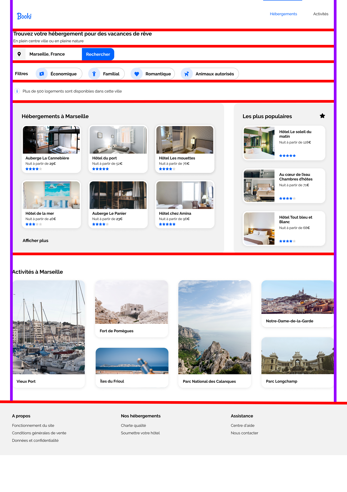

# Hello ,~~World~~ Booki !

## Description technique

### Choix des balises HTML :

* ```html
  <section> <!-- Regroupement thématique-->   
  ```

* ```html
  <article> <!-- Définit un élément autonome pour une meilleur intégration externe-->
  ```

* ```html
  <picture> <!-- Charge les images en fonction de la taille de l'écran-->
  ```

## Structure :

1. Pour centrer tous les éléments sur la page, ils sont placé dans un conteneur parent auquel sont appliqués des margins de chaque côtés.

2. Les éléments de la page sont alignés grace aux propriétés flexbox.     

3. Les break

4. Le site est décomposé en 8 parties :     
   
   * Header
   
   * Banner
   
   * Searchbar
   
   * Filters
   
   * Information
   
   * Results
   
   * Activity 
   
   * Footer        

### Ce qui nous donne :



## Propriétés utilisés:

* ```css
  display : flex; /* définit le type d'affichage utilisée par un élément*/ 
  ```

* ```css
  justify-content :; /* centre horizontalement l'élément */
  ```

* ```css
  align-items :; /* centre verticalement l'élément */
  ```

* ```css
  order :; /* change l'orde de l'élément au sein du conteneur */
  ```

* ```css
  flex-direction :; /* définit la direction (row pu colonne) d'un élément */
  ```

* ```css
  border :; /* ajoute une bordure a un element */
  ```

* ```css
  border-radius :; /* ajoute une bordure arrondie à un élément.*/
  ```

* ```css
  height :; /* definit la hauteur d'un élément.*/
  ```

* ```css
  width :;  /* definit la largeur d'un élément.*/
  ```
- ```css
  box-shadow :; /* ajoute une ombre porté sur un élément*/
  ```

- ```css
  margin :;  /* definit des marges exterieur.*/
  ```

- ```css
  padding :;  /* definit des marges interieur*/
  ```

- ```css
  transformation :;  /* applique des transformations à un élément */
  ```

- ```css
  flex-grow :;  /* définit l'expansion d'un élément flexible*/
  ```

- ```css
  object-fit:;  /* définit comment un élément doit s'adapter à sont conteneur*/
  ```

- ```css
  text-decoration:;  /* décore le text */
  ```
